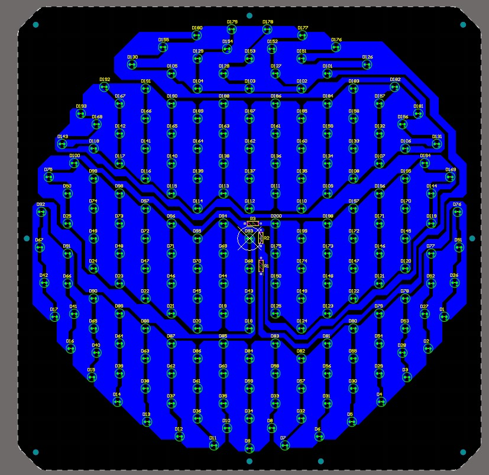
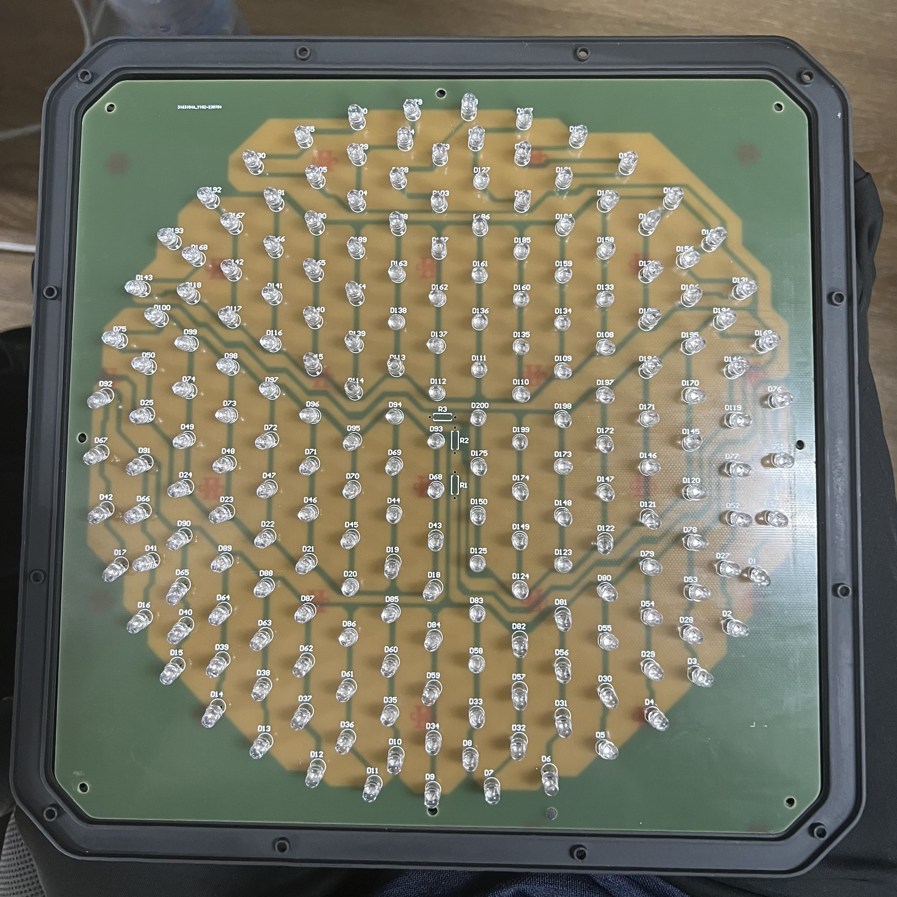
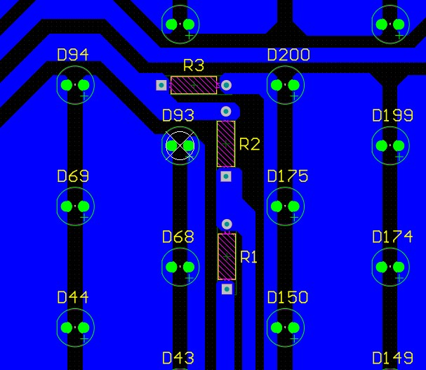
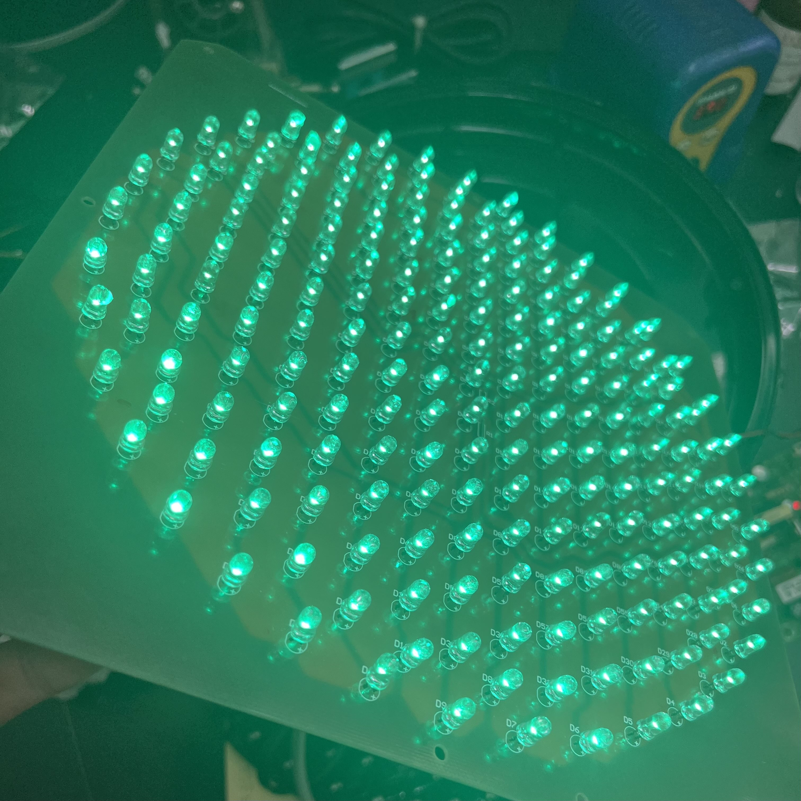
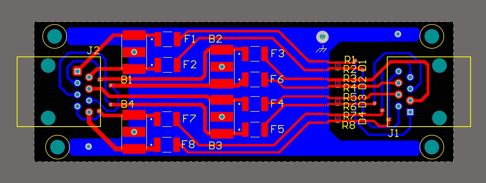
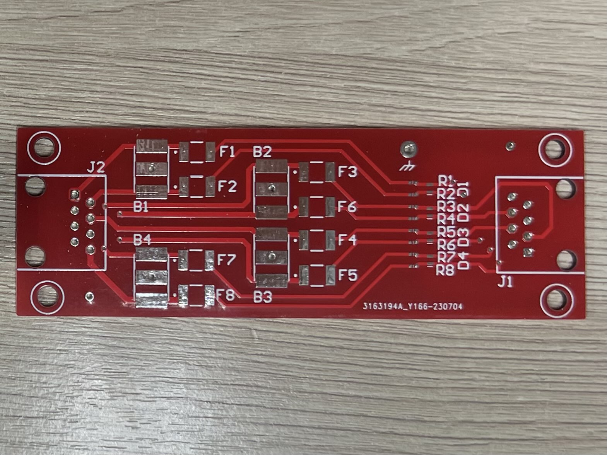
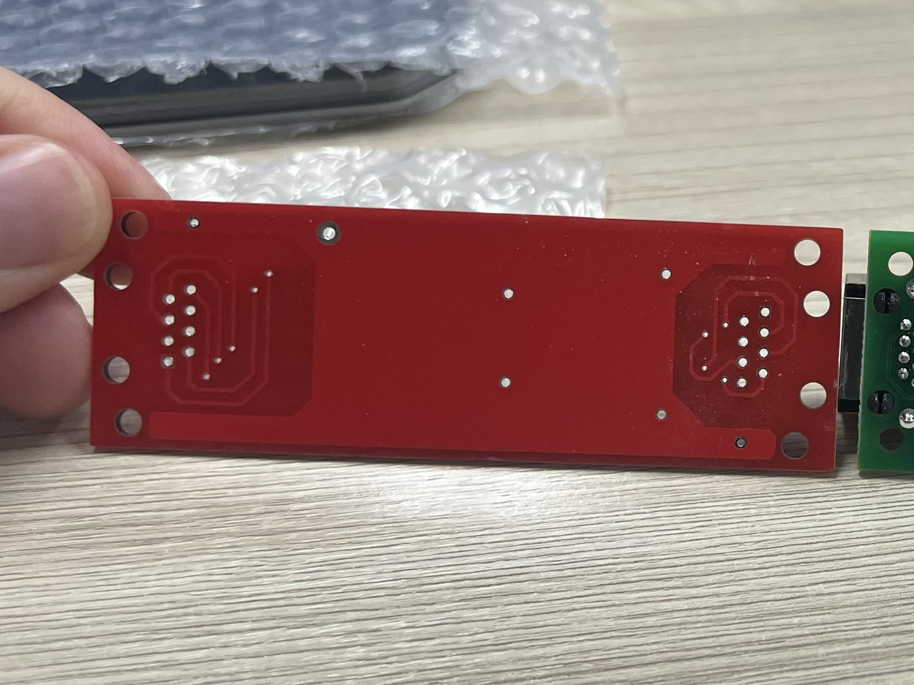
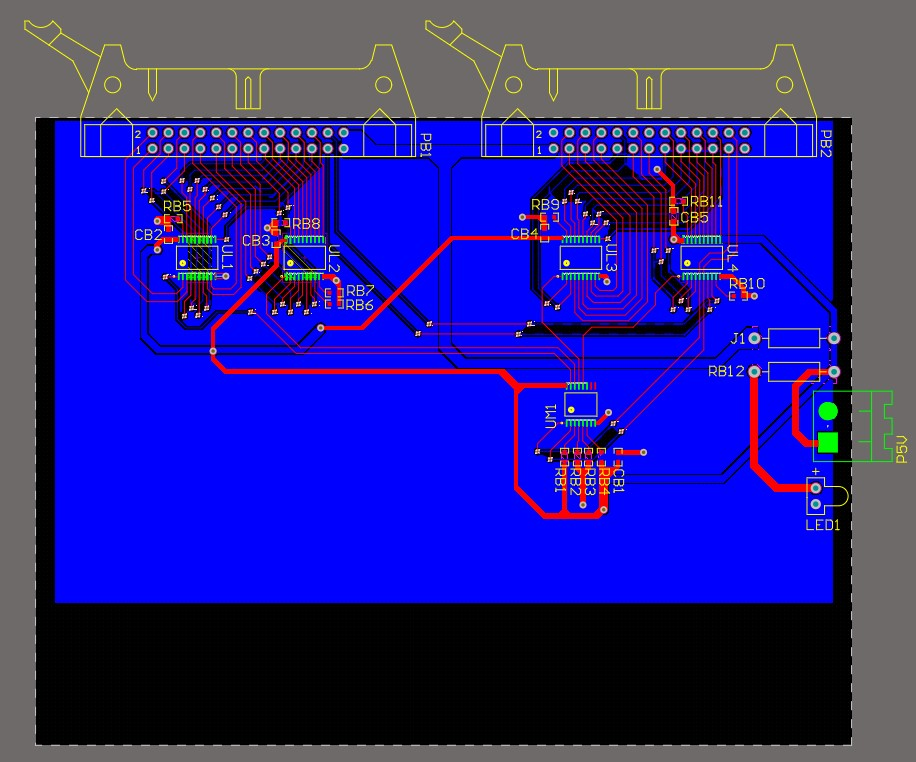
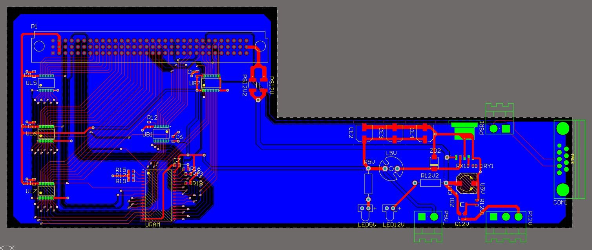

# R&D Intern - PCB Design
**Genius Traffic System Co. Ltd (GeTS)**
**Bangkok, Thailand** | *May 2023 - July 2023*

---

## Overview
During the summer of 2023, I had the opportunity to work at **Genius Traffic System Co. Ltd. (GeTS)**, one of Thailand’s leading traffic technology companies. As part of the Research and Development team, I was responsible for designing **Printed Circuit Boards (PCBs)** used in traffic infrastructure systems. These projects were crucial in modernizing legacy designs and reducing costs by developing in-house components.

### PCB Projects
- **Traffic Light:** This project involved designing a PCB for a traffic light system. I imported the initial sketch from **Fusion 360** into **Altium Designer**, then used the geometry to accurately lay out the LED array.

    
    

The PCB was engineered to support multiple colors using different resistor configurations. Series circuits powered the red and yellow LEDs, while a parallel configuration was used for the green LEDs. This allowed a single board to accommodate all necessary traffic light functions efficiently.

    
    

- **Surge Protector:** I was tasked with reverse engineering a commercial surge protector used in the company's traffic light and camera systems. By redesigning the component in-house, the company projected a **cost savings by approximately 80%** compared to third-party options. This project required creating **custom footprints** for electrical components, which I then added to the company’s component library for future use.

    

    

    

- **CPU Tester:** The most technically complex project involved designing a CPU testing board used internally to verify the functionality of GeTS machinery. The design required integration of a wide variety of electrical components, many of which had no existing footprints. I created several new component models to support this design and optimized the layout for test functionality.

    

    

## Challenges
One of the biggest challenges was learning an entirely new domain—**PCB design**—with no prior experience. I taught myself **Altium Designer** in a short time to meet project deadlines and deliver working designs. In addition, I navigated **technical communication in Thai**, further developing my ability to work across language barriers in a professional engineering environment.

## Skills & Tools
- **Software Proficiency:** Fusion 360, Altium Designer.
- **Interpersonal Skills:** Professional and technical communication in Thai and English, Working under deadlines.