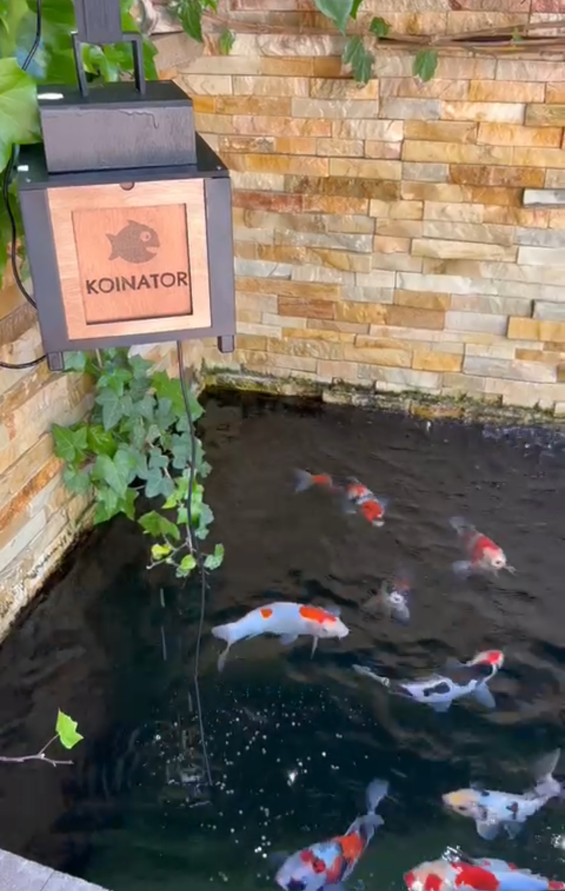
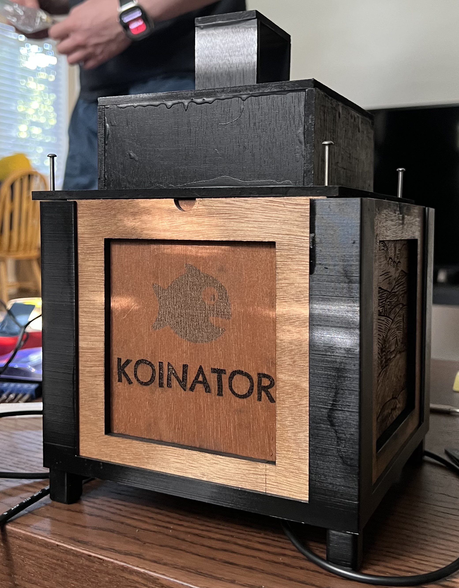
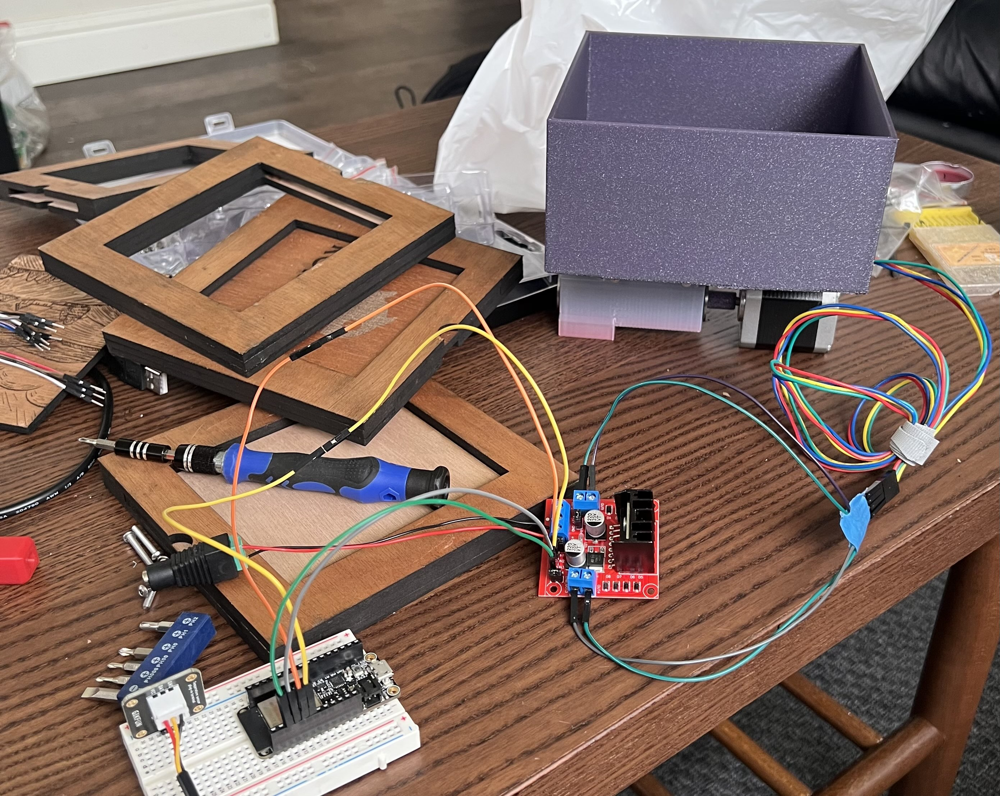
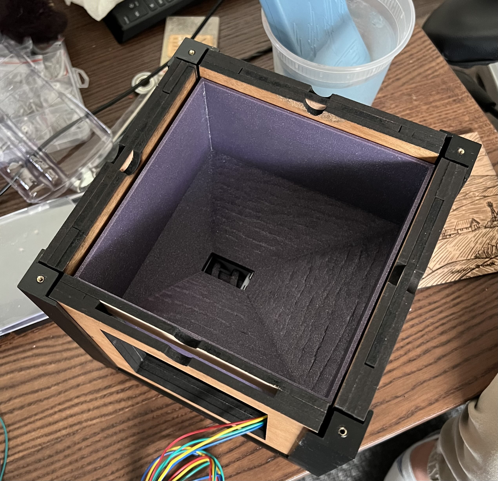
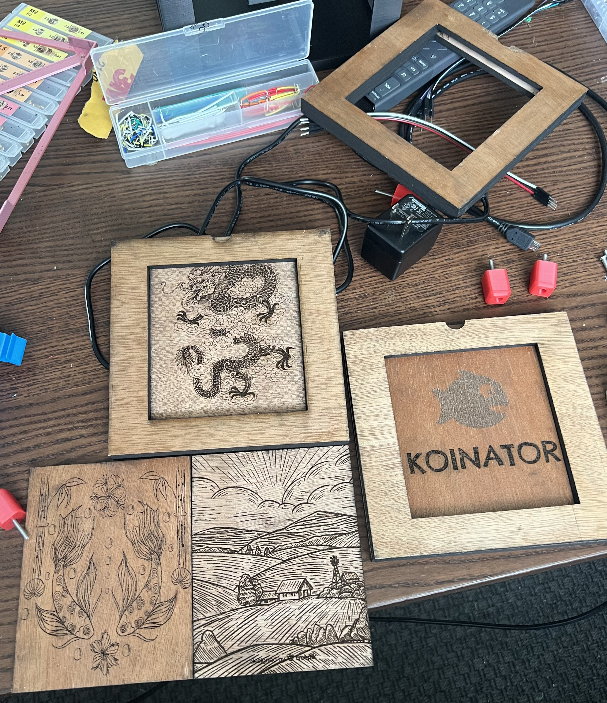

# Automatic Koi Fish Feeder
**Class: Intro to Product Development**
**UC Berkeley** | *January 2023 - May 2023*

## Overview
Our team was tasked with designing and developing a product to address a specific need within the market. The process involved engaging with potential customers, researching competing products, and creating a fully functional prototype.

    
    

## Key Contributions
In this project, I assumed both project management and design responsibilities. I selected an auger mechanism for dispensing food due to its simplicity, reliability, and consistency. This choice eliminated the need for a complex portioning system, and the reduced component count facilitated easier maintenance. Additionally, I contributed to the design of a mounting system that allows the feeder to be placed either on the ground or suspended above a pond, while also developing a flexible customization solution.

    
    

### Key Features and Design Elements
- **Customizability:** I designed the four walls of the feeder with slots to accommodate interchangeable plates. This system supports a variety of materials and designs, enabling the feeder to either blend in with or stand out in any koi pond setting.

    

- **Thermocouple Integration:** The inclusion of a thermocouple sensor was critical, as koi fish metabolism significantly slows below 10°C, potentially allowing harmful bacteria to grow in their digestive system when fed. This feature ensures the feeder operates autonomously, requiring no customer intervention beyond refilling the food.

- **Programmability:** I developed a Python-based control system that enables users to customize three key parameters: feeding time, food output, and acceptable feeding temperature. This provides customers with full control over their feeder and enables adjustments for different pond sizes and fish populations.

## Skills
- **Software:** SolidWorks, Python, MS Office, MS Excel
- **Tools:** 3D Printing, Laser Cutting, Laser Engraving