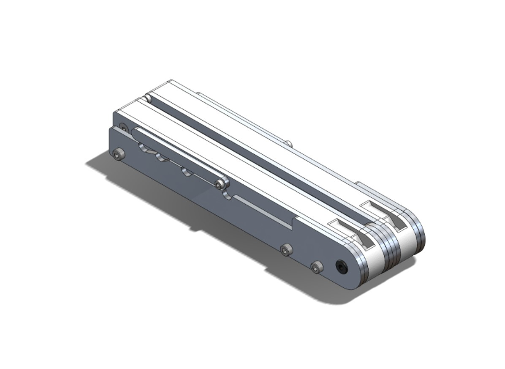
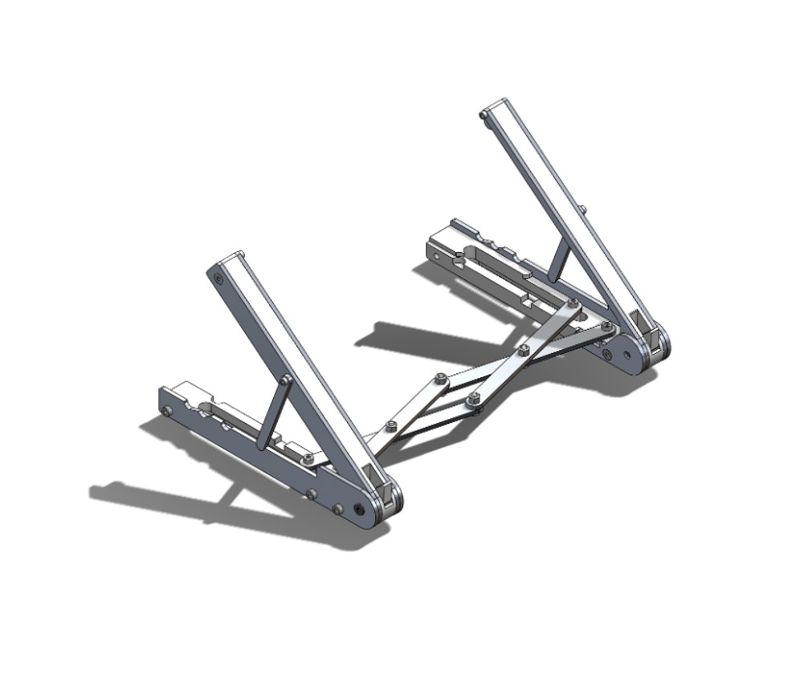

# Adjustable and Collapsible Laptop Stand
**Class: Intro to Manufacturing and Design Communication**
**UC Berkeley** | *January 2023 - May 2023*

---

## Overview
In this course, our team was challenged to design and fabricate an innovative consumer product that addresses a specific problem or need. We chose to improve **ergonomics** by developing a **collapsible laptop stand** that is **adjustable** to accomodate various laptop sizes and **sturdy** enough to support even the heaviest laptops or tablets.

    
    

    

## Key Contributions
My partner and I developed the initial concept using **SolidWorks**, manufactured precision components by **water-cutting** aluminum sheet metal, and oversaw the **fabrication** process to ensure a high-quality product.

## Final CAD Model

    
    

## Key Features and Design Elements
- **Cross-Link Mechanism:** This mechanism enables users to easily adjust the stand’s length to fit their device and fold it into a compact form for portability. The cross-link configuration provides smooth operation and maintains structural rigidity under load.

- **Adjustable Slots:** The stand features four preset angle positions, allowing users to fine-tune screen height and tilt for ergonomic comfort. These settings accommodate both laptops and tablets, promoting better posture and minimizing strain during extended use.

- **Material Selection:** To achieve a balance of strength, weight, and cost, we used 1/8-inch aluminum sheet for the main structural elements due to its high rigidity and durability. For non-load-bearing components, we utilized 3D-printed PLA to reduce manufacturing time and cost. The aluminum parts were precisely cut using our university’s waterjet machine, ensuring a clean fit and finish.

- **Compact Design:** The final product folds down to a sleek profile that fits easily in a bag or large pocket. Despite its compact size, it comfortably supports devices up to 10 lbs, offering a blend of functionality and modern aesthetics.

## Final Product

    
    

Through this project, we successfully delivered a functional, user-friendly laptop stand that combines portability, adjustability, and durability. It demonstrates our ability to apply **mechanical design** principles, thoughtful **material selection**, and **ergonomic** considerations to create a practical consumer product.

## Skills & Tools
- **Software:** SolidWorks, Google Sheets
- **Equipment:** 3D Printing , Waterjet