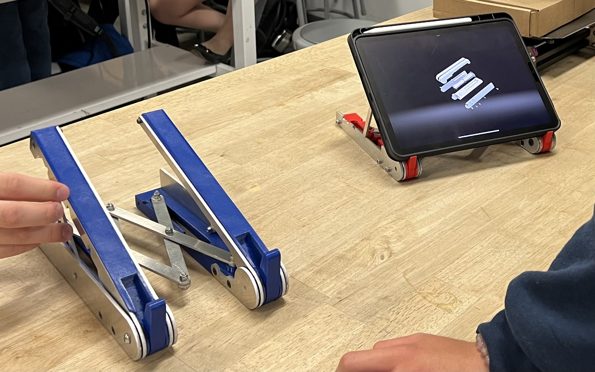
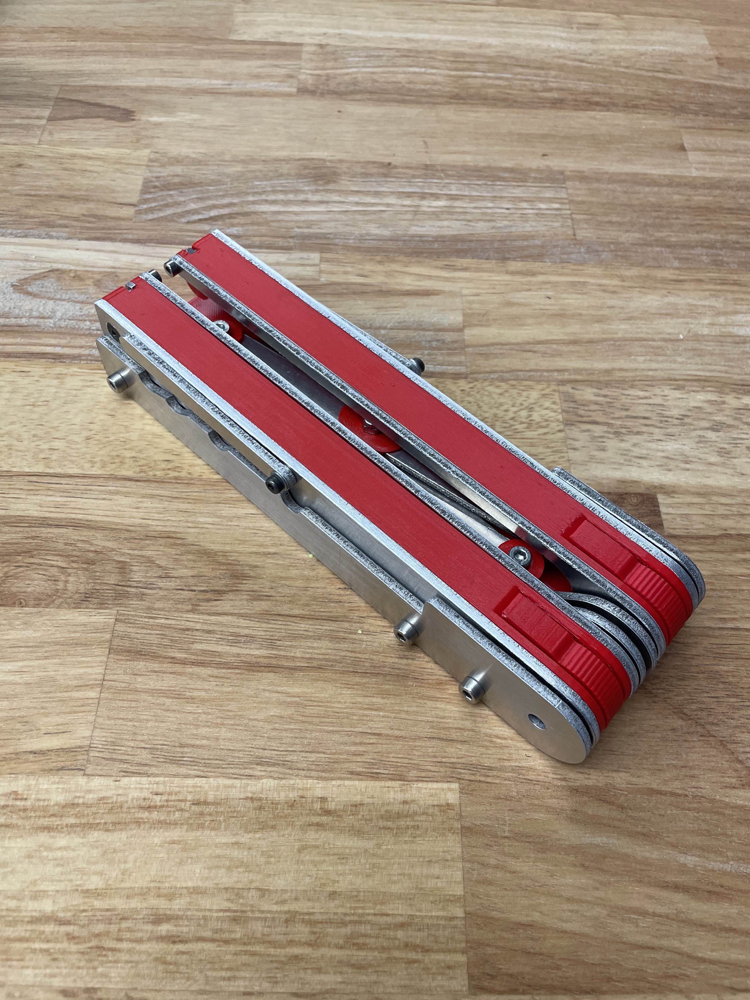
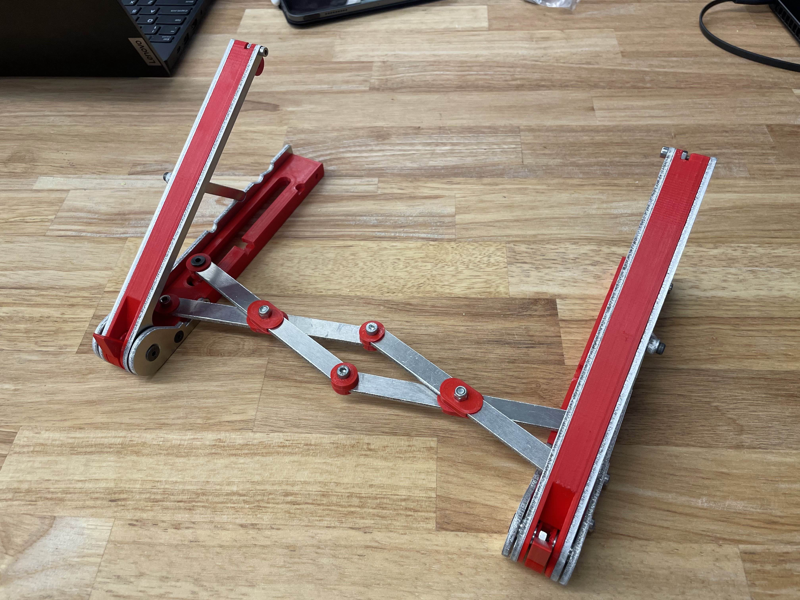

# Adjustable and Collapsible Laptop Stand
**Class: Intro to Manufacturing and Design Communication**
**UC Berkeley** | *January 2023 - May 2023*

---

    

## Overview
In this course, our team was challenged to design and fabricate an innovative consumer product that addresses a specific problem or need. Our group decided to focus on improving **ergonomics** by creating a **laptop stand** that is **collapsible** for portability, **adjustable** to accomodate various laptop sizes, and **sturdy** enough to support even the heaviest laptops or tablets.

## Key Contributions
My partner and I designed the original concept using **SolidWorks**, created precision components by **water jetting** aluminum sheet metal, and oversaw the **fabrication** process to ensure quality and accuracy.

## Final CAD Model

    
    

## Key Features and Design Elements
- **Cross-Link Mechanism:** This mechanism allows the user to easily adust the stand to fit their laptop's length and fold it back into a compact form for portability. The cross-link design ensures smooth operation while maintaining structural integrity.

- **Adjustable Slots:** The stand includes four preset angle adjustments, enabling users to customize their screen height and angle for optimal ergonomic comfort. These settings cater to both laptop and tablet users, promoting better posture and reducing strain during extended use.

- **Material Selection:** (fix the wording here) To balance durability and cost-effectiveness, we constructed the stand using 1/8-inch aluminum for its strength and rigidity, combined with 3D-printed PLA components for the housing. We cut the aluminum plate using our university machine shop's waterjet. This combination provides the sturdiness needed to support heavy devices while keeping production costs low.

- **Compact Design:** We prioritized a portable design that users could easily slip in and out of a bag or pocket. Our final product comfortably supports laptops up to 10 lbs and is nearly seamless when folded. This ensures a high-quality, modern look while maintaining practicality.

## Final Product

    
    

Through this project, we successfully delivered a functional, user-friendly laptop stand that combines portability, adjustability, and durability. It reflects our ability to integrate **mechanical design** principles, **material selection**, and **ergonomic** considerations into a practical consumer product.

## Skills & Tools
- **Software:** SolidWorks, Google Sheets
- **Equipment:** 3D Printer, Water Jet