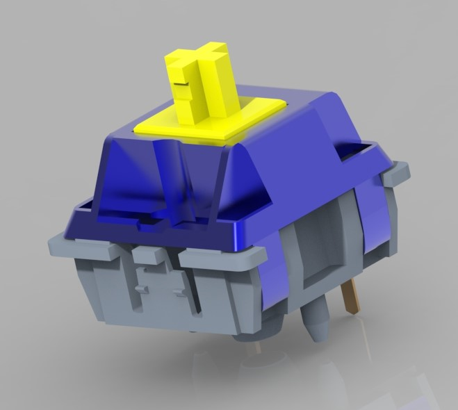
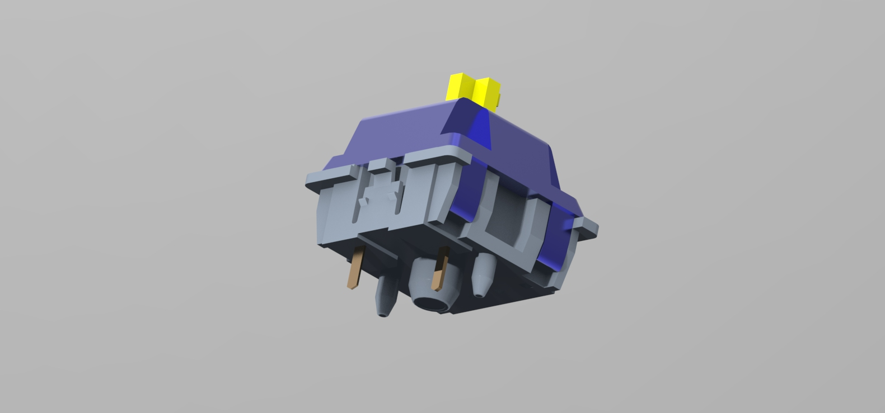
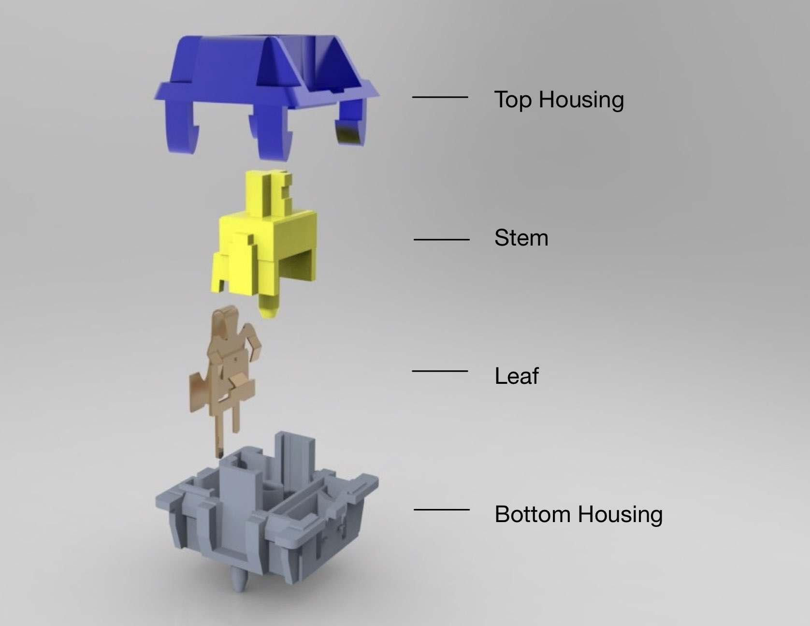
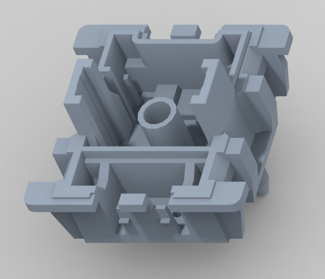
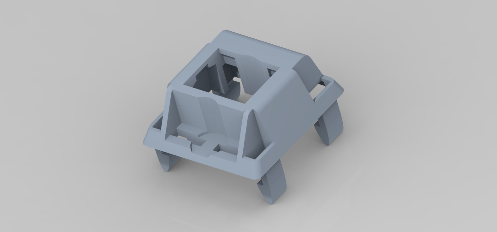
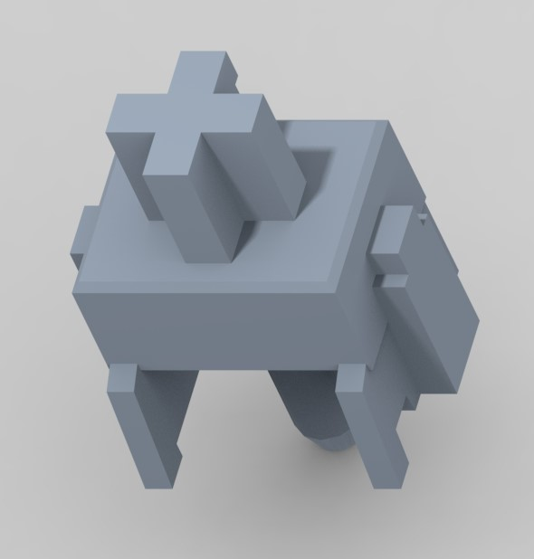
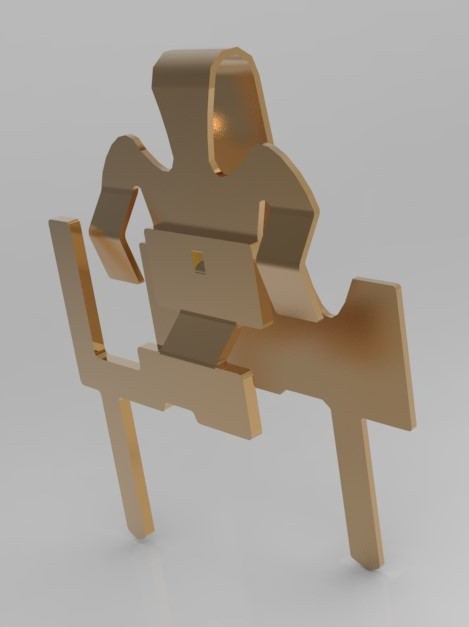

# Mechanical Keyboard Switch
**Class: Advanced Engineering Design Graphics**
**UC Berkeley** | *August 2023 - December 2023*

## Overview
In this course, our team was tasked with reverse engineering, modeling, and animating a mechanical device. We chose to illustrate the internal spring mechanism of a mechanical keyboard switch, along with the assembly process of a complete keyboard.

    
    

## Key Contributions
My primary responsibilities included precise measurement and 3D modeling of the mechanical switch using **Creo**, as well as hand-animating the mechanism in **3ds Max**.

### Mechanical Keyboard Switch
The switch consists of six key components: the top and bottom housings, stem, spring, and a two-part metal leaf. I used precision calipers for all relevant dimensions and ensured proper clearance to avoid part interference. Due to animation requirements and tool limitations, I modeled the spring directly in 3ds Max to optimize motion accuracy.

    

## Final Models

    
    

    
    

## Skills
- **Software:** Creo, 3ds Max