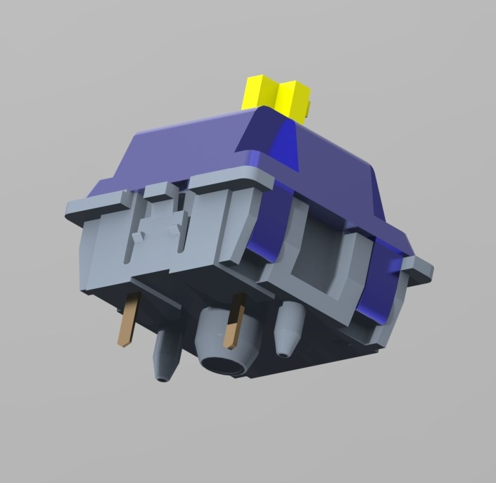
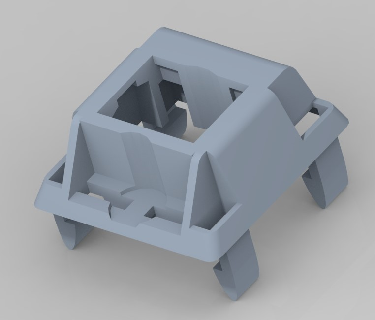

# Mechanical Keyboard Switch
**Class: Advanced Engineering Design Graphics**
**UC Berkeley** | *August 2023 - December 2023*

## Overview
In this course, our team was tasked with reverse engineering, modeling, and animating a mechanical device. We decided on showing the spring mechanism of a mechanical switch and assembly process of a full keyboard.

    
    

## Key Contributions
My focus for the project was measuring and modeling the mechanical switch in **Creo** and hand animating in **3ds Max**.

### Mechanical Keyboard Switch
The mechanical switch is made up of 6 parts including the bottom and top housing, stem, metal leaf (2 parts), and the spring. I measured all the small details of a mechanical switch using calipers. Ensured that components were not clipping into each other. Due to the animation tools available, I opted to model the spring in 3ds Max instead of Creo.

    

## Final Models

    
    

    
    

## Skills
- **Software:** Creo, 3ds Max